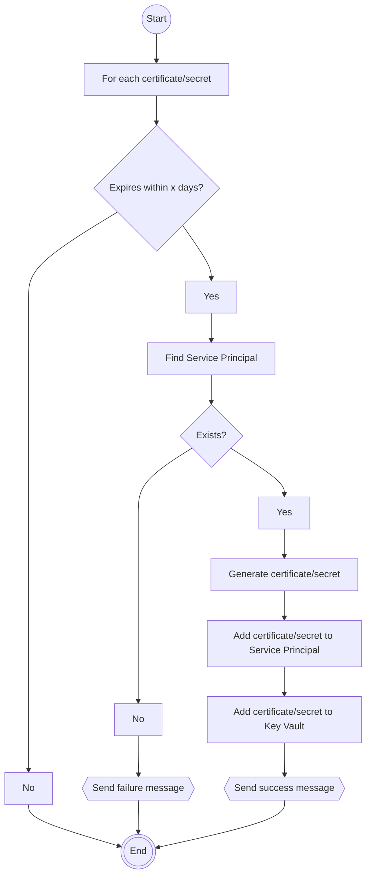

# Key Rotation Bot

## Introduction

The best way to authenticate with Azure services is by using a "Managed Identity." However, unfortunately, there are some scenarios where that's not an option because Managed Identity isn't supported. In these scenarios, Service Principals are used. These Service Principals use a secret (password/certificate), and this secret needs to be rotated regularly. In practice, we often encounter expired secrets, sometimes with significant consequences. Rotating them is not always easy because these Service Principals can be used everywhere, and their usage is often not documented. From the Expert Teams Cloud Infra & Apps and Development, the idea has emerged to consider creating an automated process for rotating these secrets.

## Requirements

- Select which service principals need to be managed
- Renew secrets of service principals x days before they expire
- Renew certificates of service principals x days before they expire
- Manage secrets/certificates in Azure Key Vault
- Support multiple Key Vaults, possibly by duplicating the solution

## Solution Approach

The solution approach is conceptually based on the [Key Vault Acmebot](https://github.com/shibayan/keyvault-acmebot). The Key Vault Acmebot is a solution for centrally managing SSL certificates. At its core, it's an Azure Function that monitors certificates in a Key Vault and automatically requests (new) certificates from a certificate authority (such as Let's Encrypt) following the Acme protocol. The Key Vault Acmebot can be used via an API or the dashboard UI. The API can, for instance, be used from Azure DevOps pipelines to automatically request certificates.

The Key Rotation Bot (working title) functions in a similar way. Like the Key Vault Acmebot, it has an API and a dashboard UI for managing Service Principals. You deploy an instance of the Key Rotation Bot per Key Vault. Each instance of the Key Rotation Bot can manage one or more service principals.

### Onboarding Service Principals for Management

The Key Rotation Bot manages the certificates and secrets of Service Principals for which it is the owner. The identity of the Key Rotation Bot is determined through a Managed Identity (System or User assigned) or a Service Principal. Managed Identity is preferred, but there are scenarios where the Service Principals live in a different tenant than the Key Rotation Bot. This is the case with, for example, the IURCSC tenant. In this latter case, the Key Rotation Bot will also need to manage its own Service Principal.

Onboarding a Service Principal for management means making the Key Rotation Bot its owner. Additionally, a new certificate or secret is added to the Service Principal and the Key Vault. Onboarding can be done via the API or the dashboard UI. The identity performing the onboarding must have sufficient permissions to change the ownership of the Service Principal. This means that the identity itself is the owner of the Service Principal or has roles like [Application Administrator](https://learn.microsoft.com/en-us/azure/active-directory/roles/permissions-reference#application-administrator).

#### Via Dashboard UI

- Click 'Add Service Principal,' a dialog appears
- Type a few letters to filter the list and find the Service Principal


- Select the Service Principal and click 'Add'
- Optionally change the key type from certificate to secret. The default is certificate.
- The dashboard UI calls the API to add the Service Principal

#### Via the API

``` http
POST /applications HTTP/1.1
Content-Type: application/json
Authorization: Bearer ...

{
  "id": "{id}",
  "keyType": "Certificate|Secret"
}
```

The API uses the [Add owner](https://learn.microsoft.com/en-us/graph/api/application-post-owners?view=graph-rest-1.0&tabs=http) operation of the Azure AD Graph API to establish the Key Rotation Bot as an owner.

### Overview of Managed Service Principals

An overview of managed Service Principals can be obtained through the API or the dashboard UI. The overview is similar to the `Owned applications` section in Azure AD.


To generate this overview, the [List applications](https://learn.microsoft.com/en-us/graph/api/application-list?view=graph-rest-1.0&tabs=http) operation of the Azure AD Graph API is employed.

## Managing Certificates and Secrets

The Key Rotation Bot performs the following management tasks on a daily basis:
- Renewing certificates and secrets that are expiring within x days
- Removing certificates and secrets that have expired (and have been renewed)

#### Renew Certificates and Secrets



- All certificates and secrets related to Service Principals in the Key Vault are reviewed.
- For each certificate and secret, it is checked whether the expiration date is within x days.
- For each certificate and secret meeting that condition, the corresponding Service Principal is looked up.
- If found, a new certificate/secret is generated, added to the Service Principal, and stored in the Key Vault.

### Remove Certificates and Secrets

For all certificates and secrets that have expired, it is checked whether there is a new valid certificate or secret. If not, a warning is sent. If yes, the certificate or secret is removed from the Service Principal and from the Key Vault.

### Webhooks

A webhook can be configured to send messages to Teams, for example, when the process succeeds or fails.