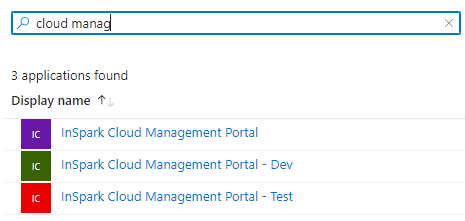
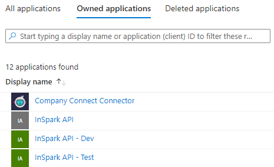
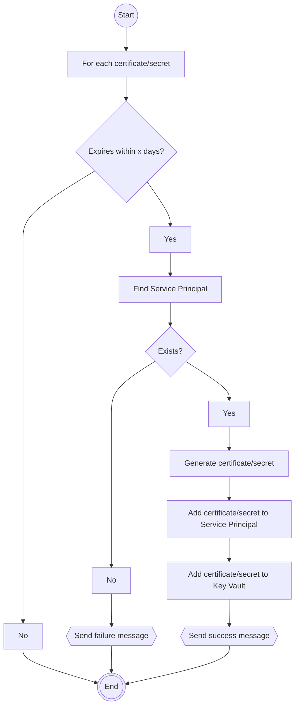

# Key Rotation Bot

## Introductie
De beste manier om te authenticeren bij Azure-services is door een "Managed Identity" te gebruiken, maar helaas zijn er enkele scenario's waarin dat geen optie is omdat er geen Managed Identity ondersteund wordt. In deze scenario's worden Service Principals gebruikt. Deze Service Prinicpals maken gebruik van een secret (wachtwoord/certificaat) en dit secret moet regelmatig roteren. In de praktijk komen we vaak verlopen secrets tegen, met soms alle gevolgen van dien. Het roteren is niet altijd eenvoudig omdat deze Service Principals overal gebruikt kunnen worden en vaak wordt het gebruik niet vastgelegd. Vanuit de Expertteams Cloud Infra & Apps en Development is het idee gekomen om na te denken om een geautomatiseerd proces te maken om deze secrets te roteren.

## Requirements
- Selecteren welke service principals beheerd moeten worden
- Secrets van service principals vernieuwen x dagen voordat ze verlopen
- Certificates van service principals vernieuwen x dagen voordat ze verlopen
- Secrets/Certificates beheren in Azure Key Vault
- Meerdere Key Vaults ondersteunen, eventueel door de oplossing te dupliceren

## Oplossingsrichting
De oplossingsrichting is conceptueel gebaseerd op de [Key Vault Acmebot](https://github.com/shibayan/keyvault-acmebot). De Key Vault Acmebot is een oplossing voor het centraal beheren van SSL certificaten. In de basis is het een Azure Function die de certificaten in een Key Vault in de gaten houdt en automatisch (nieuwe) certificaten aanvraagt bij een certificate authority (zoals Let's Encrypt) volgens het Acme protocol. De Key Vault Acmebot is te gebruiken via een API of via de dashboard UI. De API kan bijv. gebruikt worden vanuit Azure DevOps pipelines voor het automatisch aanvragen van certificates.

De Key Rotation Bot (werktitel) functioneert op een vergelijkbare manier. Net als de Key Vault Acmebot heeft het een API en een dashboard UI voor het beheren van de Service Principals. Per Key Vault deploy je een instantie van de Key Rotation Bot. Per instantie van de Key Rotation Bot kun je 1 of meer service principals beheren.

### Service Principals onboarden voor beheer
De Key Rotation Bot beheert de certificates en secrets van Service Principals waarvan de Key Rotation Bot owner is. De identity van de Key Rotation bot is bepaald via een Managed Identity (System of User assigned) of een Service Principal. De Managed Identity heeft de voorkeur, maar er zijn scenario's waarbij de Service Principals in een andere tenant leven dan de Key Rotation Bot. Dit is het geval bij bijv. de IURCSC tenant. In dit laatste geval zal de Key Rotation Bot ook haar eigen Service Principal moeten beheren.

Een Service Principal onboarden voor beheer betekent dat de Key Rotation Bot owner gemaakt wordt. Tevens wordt een nieuw certificate of secret toegevoegd aan de Service Principal en de Key Vault. Het onboarden gaat via de API of de dashboard UI. De identity die de onboarding doet moet voldoende machtigingen hebben om de ownership van de Service Principal te wijzigen. Dit betekent dat de identity zelf owner is van de Service Principal of bijv. de [Application Administrator](https://learn.microsoft.com/en-us/azure/active-directory/roles/permissions-reference#application-administrator) rol heeft.

#### Via dashboard UI
- Klik 'Add Service Principal', dialoog verschijnt
- Typ een paar letters on de lijst te filteren en de Service Principal te vinden


- Selecteer de Service Principal en klik op 'Add'
- Wijzig het key type van certificate naar secret (optioneel). De standaard is certificate.
- De dashboard UI roept de API aan om de Service Principal toe te voegen

#### Via de API
``` http
POST /applications HTTP/1.1
Content-Type: application/json
Authorization: Bearer ...

{
  "id": "{id}",
  "keyType": "Certificate|Secret"
}
```

De API gebruikt de [Add owner](https://learn.microsoft.com/en-us/graph/api/application-post-owners?view=graph-rest-1.0&tabs=http) operation van de Azure AD Graph API om de Key Rotation Bot owner te maken.

### Overzicht van beheerde Service Principals
Een overzicht van beheerde Service Principals kan via de API of de dashboard UI verkregen worden. Het overzicht is vergelijkbaar met het `Owned applications` overzicht in Azure AD.



Voor het overzicht wordt gebruik gemaakt van de [List applications](https://learn.microsoft.com/en-us/graph/api/application-list?view=graph-rest-1.0&tabs=http) operation van de Azure AD Graph API.

## Certificates en secrets beheren
Dagelijks voert de Key Rotation Bot de volgende beheertaken uit:
- Certificates en secrets vernieuwen die over x dagen verlopen
- Certificates en secrets verwijderen die zijn verlopen (en zijn vernieuwd)

#### Certificates en secrets vernieuwen


- Alle certificates en secrets in de Key Vault gerelateerd aan Service Principals worden nagelopen.
- Van ieder certificate en secret wordt gecontroleerd of de verloopdatum binnen x dagen ligt.
- Voor ieder certificate en secret dat aan die voorwaarde voldoet wordt het bijbehorende Service Principal opgezocht.
- Indien gevonden wordt een nieuw certificate/secret gegenereerd, toegevoegd aan de Service Principal en opgeslagen in de Key Vault.

### Certificates en secrets verwijderen
Van alle certificates en secrets die zijn verlopen wordt gecontroleerd of er een nieuw certificate of secret is dat geldig is. Zo niet, dan wordt er een waarschuwing gestuurd. Zo wel, dan wordt het certificate of secret verwijderd van de Service Principal en uit de Key Vault.

### Webhooks
Een webhook kan worden ingesteld om bijv. berichten naar Teams te sturen als het proces slaagt of faalt.

## :question: Openstaande vragen
- Hoe kunnen we certificates en secrets in Key Vault correleren aan een Service Principal?
  - Nemen we iets identificeerbaars van de Service Principal op in de naam van het certificate of secret, zoals het app ID? Bijv. `apps--{id}--secret` of `apps--{id}--certificate`
  - Houden we de correlatie bij in een database?
  - Kunnen we iets met het secret ID?
- Welke naamgeving hanteren we voor de secrets? Moeten we die configureerbaar maken of is dat optioneel?
