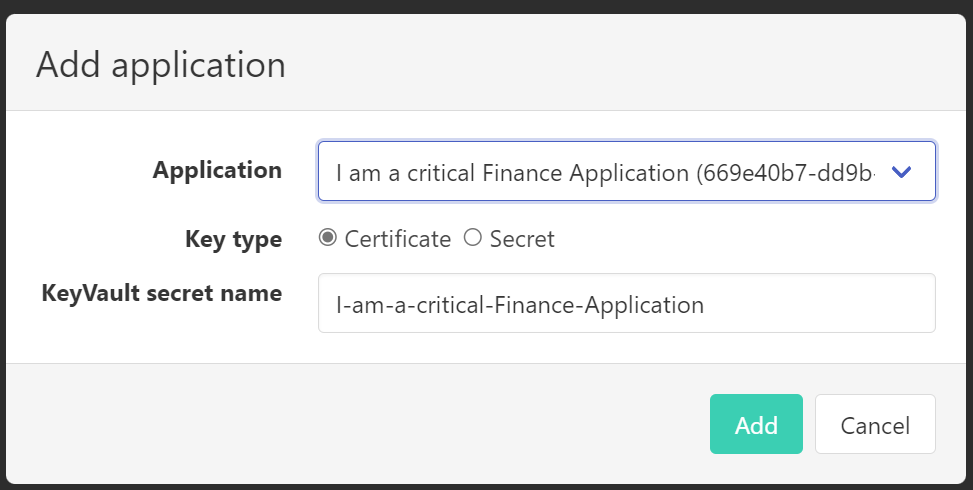
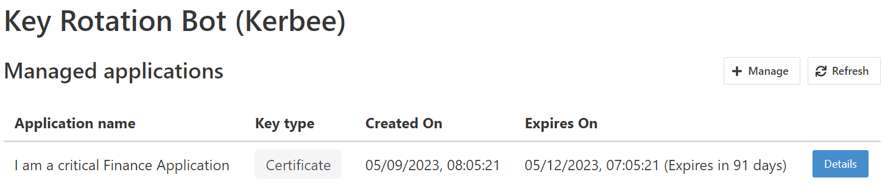
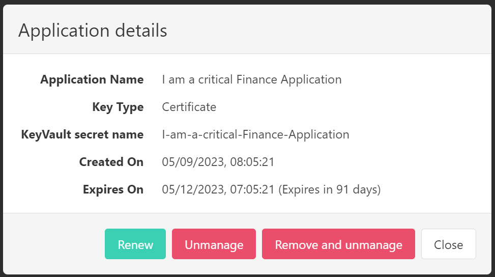
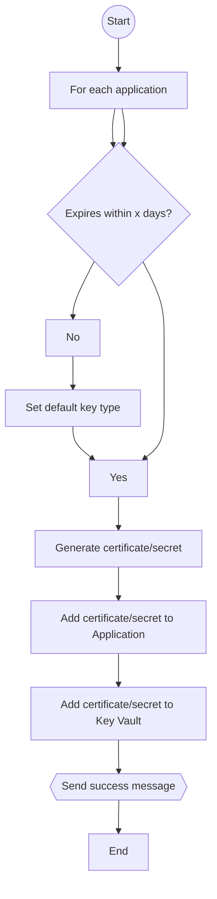

<h1 align="center">
  Key Rotation Bot (Kerbee)
</h1>
<p align="center">
  Automated Azure application registration key rotation for Azure Key Vault
</p>
<p align="center">
  <a href="https://github.com/WeAreInSpark/key-rotation-bot/actions/workflows/build.yml" rel="nofollow"></a>
  <a href="https://github.com/WeAreInSpark/key-rotation-bot/releases/latest" rel="nofollow"></a>
</p>

## Motivation

The best way to authenticate with Azure services is by using a "Managed Identity." However, there are some scenarios where that's not an option because Managed Identity isn't supported. In these scenarios, Applications are used. These Applications use a key (secret/certificate), and this key needs to be rotated regularly. In practice, keys often expire, sometimes with significant consequences. Rotating keys is not always easy because these Applications can be used everywhere, and their usage is often not documented. Kerbee is a tool to remediate this problem by automating the process for rotating these keys.

## Feature Support

- Select which Applications need to be managed
- Renew secrets of Applications x days before they expire
- Renew certificates of Applications x days before they expire
- Manage secrets/certificates in Azure Key Vault
- Perform operations via the dashboard UI or API

## Deployment

[](https://portal.azure.com/#create/Microsoft.Template/uri/https%3A%2F%2Fraw.githubusercontent.com%2FWeAreInSpark%2Fkey-rotation-bot%2Fadd-arm-file%2Fazuredeploy.json)

Learn more at [Getting Started](docs/Getting-Started.md).

## Solution Approach

The solution approach is conceptually based on the [Key Vault Acmebot](https://github.com/shibayan/keyvault-acmebot). The Key Vault Acmebot is a solution for centrally managing SSL certificates. At its core, it's an Azure Function that monitors certificates in a Key Vault and automatically requests (new) certificates from a certificate authority (such as Let's Encrypt) following the Acme protocol. The Key Vault Acmebot can be used via an API or the dashboard UI. The API can, for instance, be used from GitHub Actions to automatically request certificates.

Kerbee functions in a similar way. Like the Key Vault Acmebot, it has an API and a dashboard UI for managing Applications. You deploy an instance of the Key Rotation Bot per Key Vault. Each instance of the Key Rotation Bot can manage one or more Applications.

### Onboarding Applications for Management

The Key Rotation Bot manages the certificates and secrets of Applications for which it is the owner. The identity of the Key Rotation Bot is determined through a Managed Identity (System or User assigned) or a Application. Managed Identity is preferred, but there are scenarios where the Applications live in a different tenant than the Key Rotation Bot. In this latter case, the Key Rotation Bot will also need to manage its own Application. You need to make sure to set this up yourselves.

Onboarding a Application for management means making the Key Rotation Bot its owner. Additionally, a new certificate or secret is added to the Application and the Key Vault. Onboarding can be done via the API or the dashboard UI. The identity performing the onboarding must have sufficient permissions to change the ownership of the Application. This means that the identity itself is the owner of the Application or has roles like [Application Administrator](https://learn.microsoft.com/en-us/azure/active-directory/roles/permissions-reference#application-administrator).

#### Via Dashboard UI

- Click 'Manage,' a dialog appears
- Select the Application and click 'Add'

- Optionally change the key type from certificate to secret. The default is certificate.
- The dashboard UI calls the API to add the Application

#### Via the API

``` http
POST /applications HTTP/1.1
Content-Type: application/json
Authorization: Bearer ...

{
  "id": "{id}",
  "keyType": "Certificate|Secret"
}
```

The API uses the [Add owner](https://learn.microsoft.com/en-us/graph/api/application-post-owners?view=graph-rest-1.0&tabs=http) operation of the Azure AD Graph API to establish Kerbee as an owner.

### Overview of Managed Applications

An overview of managed Applications can be obtained through the API or the dashboard UI. The overview is similar to the `Owned applications` section in Azure AD.



To generate this overview, the [List applications](https://learn.microsoft.com/en-us/graph/api/application-list?view=graph-rest-1.0&tabs=http) operation of the Azure AD Graph API is employed.

### Managing Applications

There are a few options for managing the applications by clicking on the `Details` button:
- `Renew` - Renew the certificate or secret of the Application, which will replace the currently managed certificate or secret.
- `Unmanage` - Remove the Application from management. This will _not_ remove the certificate or secret from the Application and the Key Vault.
- `Remove and unmanage` - Remove the Application from management and remove the certificate or secret from the Application and the Key Vault.



## Managing Certificates and Secrets

The Key Rotation Bot performs the following management tasks on a daily basis:
- Renewing certificates and secrets that are expiring within x days
- Removing certificates and secrets that have expired (and have been renewed)

#### Renew Certificates and Secrets



- All applications owned by Kerbee are reviewed.
- For each application, it is checked whether the expiration date of the certificate or secret is within x days.
- For each application meeting that condition a new certificate/secret is generated, added to the Application, and stored in the Key Vault.
- If there's no certificate or secret available for the application, the default key type is used (certificate).

### Remove Certificates and Secrets

All certificates and secrets of the managed applications that have expired the certificate or secret is removed from the Application.

### Webhooks (_not yet implemented_)

A webhook can be configured to send messages to Teams, for example, when the process succeeds or fails.