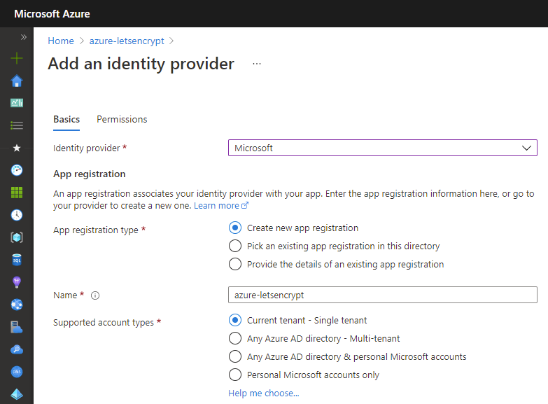
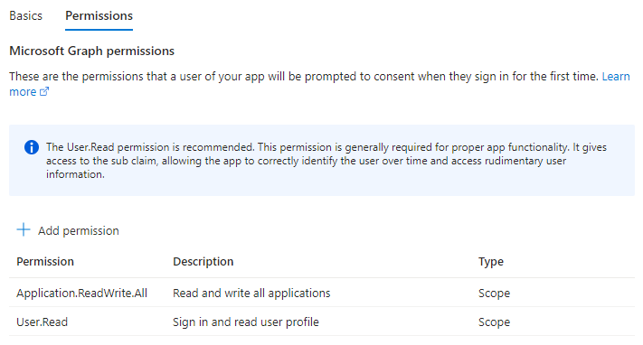
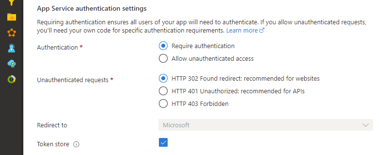
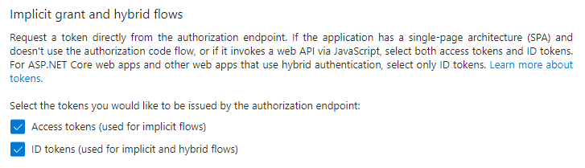

# Getting Started

## Deploy Kerbee

[](https://portal.azure.com/#create/Microsoft.Template/uri/https%3A%2F%2Fraw.githubusercontent.com%2FWeAreInSpark%2Fkey-rotation-bot%2Fadd-arm-file%2Fazuredeploy.json)

## Add application settings

Update the following configuration settings of the Function App:

- `Kerbee:ValidityInMonths` - The validity of the certificate in months. The default is 3 months.
- `Kerbee:RenewBeforeExpiryInDays` - The number of days before expiry to renew the certificate. The default is 30 days.
- `Kerbee:DefaultKeyType` - The default key type. The options are `Certificate` or `Secret`. The default is `Certificate`.

## Enable App Service Authentication

You must enable Authentication on the Function App that is deployed as part of this application.

In the Azure Portal, open the Function blade then select the `Authentication`` menu and enable App Service authentication. Click on the `Add identity provider`` button to display the screen for adding a new identity provider. If you select `Microsoft`` as your Identity provider, the required settings will be automatically filled in for you. The default settings are fine.



Add the following permissions on the `Permissions` tab:

| Permission | Description |
| --- | --- |
| Application.ReadWrite.All | Required to add the Key Rotation Bot as an owner of a Service Principal. |
| User.Read | Required to sign in and read the profile of the signed-in user. |



Make sure that the App Service Authentication setting is set to `Require authentication`. The permissions can basically be left at the default settings.



If you are using Sovereign Cloud, you may not be able to select Express. Enable authentication from the advanced settings with reference to the following document.

https://docs.microsoft.com/en-us/azure/app-service/configure-authentication-provider-aad#-configure-with-advanced-settings

Finally, you can save your previous settings to enable App Service authentication.

## Enable access tokens

The Key Rotation Bot uses access tokens to access the Azure AD Graph API. The access tokens are obtained from the Azure AD v2.0 endpoint. To enable access tokens, navigate to the `Authentication` section of the application registration in the Azure Portal. Select the checkbox `Access tokens` in the `Implicit grand and hybrid flows` section and click `Save`.



## Modify login parameters

The Key Rotation Bot needs to acquire an access token which includes the scopes for the Microsoft Graph. By default Easy Auth only requests the `openid` scope. To request the additional scopes we need to modify the login parameters. Run the following PowerShell script to modify the login parameters:

``` powershell
$subscriptionId = "<subscription-id>"
$resourceGroup = "<resource-group>"
$functionAppName = "<function-app-name>"

az login --subscription $subscriptionId

$auth = az webapp auth show --resource-group $resourceGroup --name $functionAppName |
    ConvertFrom-Json |
    Select-Object -ExpandProperty properties

$auth.identityProviders.azureActiveDirectory.login = @{
    disableWWWAuthenticate = $false
    loginParameters = @("scope=https://graph.microsoft.com/.default openid")
}

$json = $auth | ConvertTo-Json -Compress -Depth 10
$json = $json.replace("`"", "\`"")
az webapp auth set --resource-group $resourceGroup --name $functionAppName --body $json
```

## Assign permissions to managed identity

The Key Rotation Bot uses a managed identity to access the Azure AD Graph API. The managed identity needs to be assigned the `Application.ReadWrite.OwnedBy` role on the Azure AD Graph API. Run the following PowerShell script to assign the role:

``` powershell
$tenantId = "<tenant-id>"
$managedIdentityName = "<managed-identity-name>"

Connect-AzAccount -Tenant $tenantId

$principal = Get-AzADServicePrincipal -Filter "displayName eq '$managedIdentityName'"
$resource = Get-AzADServicePrincipal -Filter "appId eq '00000003-0000-0000-c000-000000000000'"

$appRole = $resource.AppRole |
    Where-Object {($_.Value -eq "Application.ReadWrite.OwnedBy") -and ($_.AllowedMemberType -contains "Application")}

Connect-MgGraph -TenantId $tenantId

$appRoleAssignment = @{
    PrincipalId = $principal.Id
    ResourceId = $resource.Id
    AppRoleId = $appRole.Id
}

New-MgServicePrincipalAppRoleAssignment `
     -ServicePrincipalId $appRoleAssignment.PrincipalId `
     -BodyParameter $appRoleAssignment `
     -Verbose
```